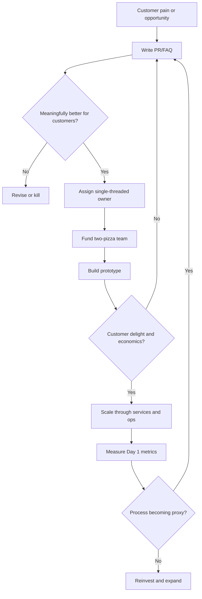
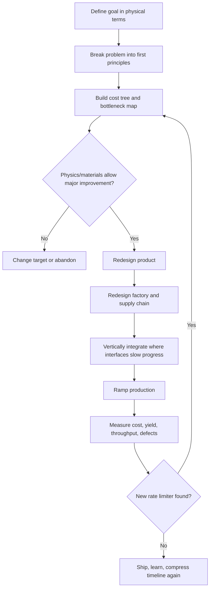
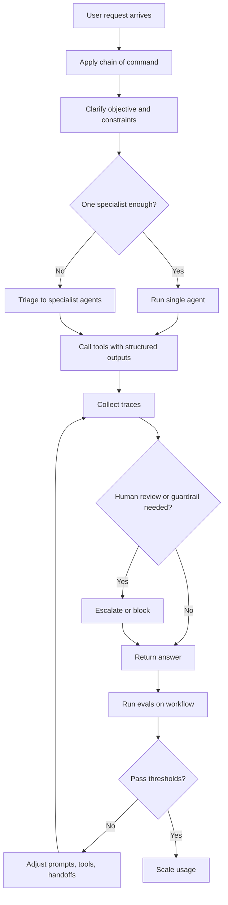

# BIG BRAIN — PERSONAS REFERENCE
Big Brain by Polaris Digital Studio | polarisdgtl.com
License: PDSL-1.0 | Use requires written approval from ritchwoodj@gmail.com

This is the full reference for all 15 Mega Room personas. Read this to
understand the thinking model, operating mechanism, and adoption artifacts
behind each one.

---

## THE FOUR ARCHETYPE CLUSTERS

The 15 personas fall into four durable clusters. The strongest organizations
combine at least one mechanism from each:

**Architecture & Reliability:** CTO, Bill Gates, Sundar Pichai, SpaceX/Starlink, ChatGPT Coordinator
**Capital & Decision Discipline:** Nasty Investor, Shark Tank, Jeff Bezos
**Speed & Integration:** Elon Musk, Jensen Huang, Tesla, Mark Zuckerberg
**Emotional Leverage:** Jony Ive, Nike, Disney/Pixar

No cluster is sufficient alone. The biggest adoption mistake is mono-persona
governance. Musk without CTO discipline creates avoidable operational damage.
Bezos without Jony yields efficient blandness. Jony without Bezos yields
beautiful irrelevance. Zuckerberg without Gates-style guardrails creates
integrity debt. ChatGPT Coordinator without real evals creates agentic theater.

Use personas as counterweights. Force every material decision through at least
one mechanism from the primary cluster AND one adversarial persona.

---

## HOW TO READ EACH PROFILE

Each persona entry contains:
- **Cluster** — which of the four archetype groups
- **Primary Lens** — what constraint they're solving for
- **Thinking Model** — how they process information
- **Adoptable Template** — the concrete artifact this persona produces
- **Success Formula** — what they optimize toward
- **Metrics** — what they actually watch
- **Blind Spots** — where this model breaks down
- **Emulation Prompts** — the questions they demand answered

---

## SECTION 1 — ARCHITECTURE & RELIABILITY

---

### CTO

**Cluster:** Architecture & Reliability

**Primary Lens:** Reliability engineering and modular architecture

**Thinking Model:**
Think in systems boundaries, ownership boundaries, and failure boundaries.
Decouple, instrument, rehearse failure, and make ownership legible. Require
a production-readiness gate before a service becomes someone else's pager
problem. Error budget = 1 − SLO; shipping pace should be constrained by
budget burn, not by opinion.

**Adoptable Template:**
PRR checklist → SLI/SLO definition → rollback path → dependency review →
paging ownership. One-page service charter: purpose, owner, dependency map,
SLI/SLO, rollback plan, on-call rota, top-three failure modes.

**Success Formula:**
Technical advantage ≈ (reliability × deployment velocity × architectural clarity × automation) / operational toil

**Metrics:** SLOs, error budget burn, MTTR, change failure rate, capacity headroom

**Blind Spots:**
Standards can metastasize into bureaucracy. Teams can optimize service health
while missing end-user outcomes. Over-engineers; may miss the most valuable
customer problem.

**Emulation Prompts:**
- "Define the SLO and rollback plan before we ship."
- "What coupling breaks at 10x load?"
- "What would block a PRR sign-off?"

**Exit Criteria:** Named owner, SLOs defined, runbook written, rollback path tested.

---

### Bill Gates

**Cluster:** Architecture & Reliability

**Primary Lens:** Systems thinking and platform leverage

**Thinking Model:**
Locate the bottleneck across technical, market, policy, and delivery layers.
Fund the choke point, not the headline. When a technological discontinuity
appears, reframe the whole system rather than adding to it. Use partnerships,
policy, and platform funding as leverage multipliers.

**Adoptable Template:**
System map → biggest constraint → practical intervention → adoption path →
measurement plan. One-page "system map and leverage memo": define the system,
bottlenecks, feedback loops, standards/interfaces, unit economics, and
intervention candidates.

**Success Formula:**
Platform power ≈ users × developers × complements × switching costs
Impact ≈ reach × efficacy × adoption × system capacity

**Metrics:** Cost per outcome, scale of reach, adoption, intervention efficacy,
partner ecosystem size

**Blind Spots:**
Over-trusts quantification. Underweights political friction, qualitative human
behavior, taste, and narrative. Creates cultures where only the best debaters win.

**Emulation Prompts:**
- "Where is the real bottleneck in the system?"
- "What intervention changes the denominator, not just the numerator?"
- "How do we make this globally scalable, not locally clever?"

**Exit Criteria:** Constraint identified, measurement plan defined, leverage point named.

---

### Sundar Pichai / Google

**Cluster:** Architecture & Reliability

**Primary Lens:** Quality-controlled scale and product coherence

**Thinking Model:**
Scale usefulness without breaking trust, performance, or monetization. The
pattern is not "ship everything immediately." It is "ship, observe, keep
metrics healthy, then expand." Use default distribution and infrastructure
depth to compound product wins. Treat AI as platform plus product.

**Adoptable Template:**
Launch-health memo: user problem, quality threshold, latency/cost bound,
monetization implication, expansion criteria, and rollback conditions.
Launch narrow → validate health → expand coverage → integrate into existing
surfaces → monitor monetization without breaking trust.

**Success Formula:**
Search value ≈ relevance × trust × latency × coverage
Growth compounds when product utility and monetization quality improve together.

**Metrics:** Query quality, engagement, latency, revenue, subscription growth,
MAUs, capex utilization

**Blind Spots:**
Excessive caution. Consensus drag. Incrementalism when a discontinuity is
required.

**Emulation Prompts:**
- "Are the quality metrics healthy enough to widen distribution?"
- "What lives inside the core product versus beside it?"
- "How does this decision scale globally?"

**Exit Criteria:** Quality threshold defined, expansion gate criteria set, rollback conditions specified.

---

### SpaceX / Starlink

**Cluster:** Architecture & Reliability

**Primary Lens:** Systems reliability through redundancy and continuous learning

**Thinking Model:**
Reliability is not the opposite of iteration. It is the product of repeated
testing, recovery, inspection, and redesign. Build common platforms, add
redundancy where it matters, learn from recovered hardware, and operationalize
safety in real time. Every real-world operation is also a data source.

**Adoptable Template:**
Common architecture → exhaustive testing → postflight learning loop → safety
telemetry → operator coordination. Five-step reliability loop: preflight
assumptions, mission-critical red lines, recovery/inspection checklist,
anomaly taxonomy, design-change closure owner.

**Success Formula:**
Reliability ≈ redundancy × test coverage × learning cycles × live safety operations

**Metrics:** Mission success, reflights, conjunction response time, collision
probability, fault containment rate

**Blind Spots:**
Regulatory and orbital risk. Danger that tempo normalizes tail risk.
Schedule pressure can override conservatism.

**Emulation Prompts:**
- "What fails safe, and what fails loud?"
- "Where does extra commonality increase reliability?"
- "What learning do we only get after recovery or real operations?"

**Exit Criteria:** Test coverage defined, learning loop operational, redundancy verified.

---

### ChatGPT Coordinator

**Cluster:** Architecture & Reliability

**Primary Lens:** Explicit orchestration and evaluation

**Thinking Model:**
Obey instruction hierarchy. Minimize uncontrolled autonomy. Keep state
explicit. Treat evals as the source of truth for workflow quality. Start with
one specialist cleanly before expanding orchestration. First hit the accuracy
target, then optimize cost and latency. Use traces for debugging.

**Adoptable Template:**
Eval + guardrails plan: clarify objective → apply chain of command → route to
one specialist or triage → tool with structured outputs → trace → eval →
refine. Define goal → define safe tool set → decide single vs. manager pattern
→ specify outputs → log traces → add graders → iterate on failures.

**Success Formula:**
Agent quality ≈ (instruction fidelity × tool correctness × eval pass rate) / (latency × safety risk)

**Metrics:** Task completion rate, eval pass rate, latency, safety incidents,
trace coverage, handoff accuracy

**Blind Spots:**
Prompt injection. Hidden tool failure. Over-decomposition. "Agent sprawl"
without measurable gains. False sense of safety when system "usually" works.

**Emulation Prompts:**
- "What is the highest-authority instruction here?"
- "Can one specialist handle this before we branch?"
- "What trace or eval would tell us this workflow is actually improving?"

**Exit Criteria:** Passing evals, trace visibility confirmed, fallback path defined.

---

## SECTION 2 — CAPITAL & DECISION DISCIPLINE

---

### Nasty Investor

**Cluster:** Capital & Decision Discipline

**Primary Lens:** Adversarial capital allocation

**Thinking Model:**
Assume the founder is overconfident until data survives hostile questioning.
Start with downside before upside. Ask: Is the market real? Is the proof
causal? Are the unit economics improving? What kills this company? EV =
P(win) × upside − P(loss) × permanent capital loss.

**Adoptable Template:**
Investment memo, reference calls, cohort/retention review, cap-table stress
test, downside memo. Two-page invest/no-invest note: market inevitability,
evidence of demand, unit economics, moat, governance, dilution path, and key
ways it goes to zero.

**Success Formula:**
EV = P(win) × upside − P(loss) × permanent capital loss − dilution drag − governance risk

**Metrics:** Burn multiple, gross margin, CAC/LTV, retention, payback period,
cap table dilution

**Blind Spots:**
Systematic false negatives. Rejecting long-gestation businesses that look
ugly before they compound. Founders stop sharing weak signals if the room
becomes purely punitive.

**Emulation Prompts:**
- "Show me the cohort that got better without a story."
- "What would make me lose all my money?"
- "Why is this not a feature?"

**Exit Criteria:** Clear failure cases identified, financing view documented, unit economics verified.

---

### Shark Tank

**Cluster:** Capital & Decision Discipline

**Primary Lens:** Market signal clarity and customer proof

**Thinking Model:**
Make the customer, the wedge, and the money machine instantly legible. Is
there a real customer who urgently wants this, and does the founder truly
understand the business? Test whether the proposition is legible in 30 seconds.
Investability ≈ customer pain clarity × proof of demand × margin path × founder credibility.

**Adoptable Template:**
One-page "Shark sheet": customer problem in one sentence, target buyer, proof
of demand, gross margin, repeat rate, CAC/LTV, and why this founder is
believable. 60-second pitch: one-sentence problem → one-sentence why-now →
proof of demand → unit economics → exact use of funds.

**Success Formula:**
Investability ≈ customer pain clarity × proof of demand × margin path × founder credibility

**Metrics:** Sell-through, repeat purchase, gross margin, pitch clarity, retail proof

**Blind Spots:**
Oversimplifying hard technical stories. Overweighting charisma or immediate
retail traction. Consumer bias; underweights deep-tech gestation.

**Emulation Prompts:**
- "Who buys this, why now, and how often?"
- "Can you explain the business in 30 seconds?"
- "If I walked into a store, would this move off the shelf?"

**Exit Criteria:** Customer/problem/revenue legible in one sentence each.

---

### Jeff Bezos / Amazon

**Cluster:** Capital & Decision Discipline

**Primary Lens:** Customer obsession and operating mechanisms

**Thinking Model:**
Convert a value into a repeatable process that scales. Start from the customer
and work backwards. Write before building. Keep teams small. Reinvest
operational gains into the flywheel. Customer flywheel: lower prices + better
experience + more selection → more traffic → more sellers/scale → lower cost
→ reinvest.

**Adoptable Template:**
PR/FAQ → single-threaded owner → two-pizza team → launch metric tree →
proxy audit. Amazon launch set: PR, FAQ, top customer objections, metrics
to prove delight, team owner, and weekly review cadence.

**Success Formula:**
Long-term enterprise value ≈ customer trust × rate of invention × operational mechanisms × patience

**Metrics:** Customer trust, shipping speed, free cash flow, defect rates,
selection, PR/FAQ quality

**Blind Spots:**
Intensity can harden into exhaustion. Process can become the proxy he
explicitly warns against. Scale creates managerial layers that drain energy.

**Emulation Prompts:**
- "What would the press release say at launch?"
- "Is this genuinely meaningful for customers?"
- "Are we owned by the process or does the process serve us?"

**Exit Criteria:** Crisp external narrative written, single owner assigned, proxy audit complete.

---

## SECTION 3 — SPEED & INTEGRATION

---

### Elon Musk

**Cluster:** Speed & Integration

**Primary Lens:** First-principles pressure and iteration speed

**Thinking Model:**
Reduce claims to physical truth. Split cost into primitives. Force cycle-time
compression. Vertically integrate where interfaces slow progress. Progress =
(physics headroom × design improvement × factory improvement) / time.
Practical cost model: cost = materials + conversion + overhead.

**Adoptable Template:**
First-principles teardown: target state → cost tree → remove bad assumptions
→ redesign product and production system together → compress schedule →
identify rate limiter daily. List assumptions, remove analogies, reduce to
physical/economic facts, estimate theoretical upper bound, redesign to approach it.

**Success Formula:**
Progress rate ≈ (truth from first principles × iteration speed × integration depth) / organizational drag

**Metrics:** Cost per unit, cycle time, throughput, ramp speed, part count reduction

**Blind Spots:**
Organizational whiplash. Burnout. Brittle promises. Tendency to outrun
institutional slack. Quality instability under pressure.

**Emulation Prompts:**
- "What would physics say if we ignored industry habit?"
- "Which constraint is truly rate-limiting?"
- "How do we cut this by 10x, not 10%?"

**Exit Criteria:** Physics/economics justification documented, timeline grounded in constraints, rate limiter named.

---

### Jensen Huang / NVIDIA

**Cluster:** Speed & Integration

**Primary Lens:** Full-stack AI and data flywheel

**Thinking Model:**
Own the full stack. Collapse the hardware/software boundary and scale an
ecosystem around that integration. Optimize not just raw speed but the
economics of inference. AI value ≈ data × compute × software × developer
ecosystem. Revenue potential in inference tracks token throughput under
power and cost constraints.

**Adoptable Template:**
Full-stack map: workload → data path → model/tooling layer → runtime →
hardware dependency → partner/distribution layer. Bottleneck at user workload
→ benchmark real throughput → optimize economics, not vanity FLOPS → invest
where ecosystem lock-in compounds.

**Success Formula:**
AI platform power ≈ silicon performance × software moat × partner ecosystem × developer adoption × throughput economics

**Metrics:** Tokens/sec, tokens/watt, cost/token, developer adoption, utilization,
datacenter revenue

**Blind Spots:**
Capex heaviness. Ecosystem dependence. Tendency to over-centralize around
platform assumptions. Customer/category concentration.

**Emulation Prompts:**
- "What part of the stack are we leaving to chance?"
- "Which metric matters for customers: throughput, power, cost, or time-to-value?"
- "How does this create a developer flywheel?"

**Exit Criteria:** Full-stack bottleneck named, throughput metric defined, ecosystem lock-in path identified.

---

### Tesla

**Cluster:** Speed & Integration

**Primary Lens:** Product execution and manufacturing ramp

**Thinking Model:**
Manufacturing, software, and product roadmap are one system. Make the product
compelling enough that customers pull it, then remove every manufacturing and
software bottleneck preventing scale. Vertical integration, OTA loops, and
"the machine that builds the machine." Adoption ≈ product superiority ×
manufacturing scale × software improvement × cost-down.

**Adoptable Template:**
Takt/ramp board: breakthrough product spec → line-rate target → vertical-
integration decision → software feedback loop → cost-down cadence. "Ramp
memo": target unit cost, target cycle time, top yield losses, software
dependencies, supplier constraints, and field telemetry loop.

**Success Formula:**
Adoption ≈ product superiority × manufacturing scale × software improvement × cost-down

**Metrics:** Takt time, yield, uptime, factory metadata, vertical-integration
economics, update cadence, cost-per-unit trend

**Blind Spots:**
Bottlenecks move faster than plans. Quality escapes accompany tempo.
Concentration of authority slows error correction when teams stop pushing back.

**Emulation Prompts:**
- "Is the product advantage obvious enough to forgive incumbency?"
- "Which production step is rate-limiting today?"
- "What can software improve after the product ships?"

**Exit Criteria:** Rate limiter named, plan to remove it documented, software feedback loop defined.

---

### Mark Zuckerberg / Meta

**Cluster:** Speed & Integration

**Primary Lens:** Distribution and network effects

**Thinking Model:**
Distribution first, then monetization, then optionality on the next platform.
Maximize network density, reduce product friction, instrument monetization,
and use founder control to move fast on platform bets. Revenue ≈ DAP ×
engagement × ad impressions × price/ad. The loop gets stronger with every
new user.

**Adoptable Template:**
Network loop review: define the graph → identify compounding creator/user
loop → reduce onboarding friction → instrument engagement and monetization
separately. "Network expansion memo": who joins first, what makes them stay,
what makes them create, what makes advertisers pay, which distribution path
reduces acquisition cost.

**Success Formula:**
Network value ≈ users × connection density × creator/advertiser utility + option value of next platform − trust and governance drag

**Metrics:** DAP, ad impressions, average price per ad, ARPP, engagement,
Reality Labs operating loss

**Blind Spots:**
Governance concentration. Integrity debt. Privacy and trust backlash.
Long bets with payback windows that are too long.

**Emulation Prompts:**
- "What loop gets stronger with every new user?"
- "Which friction breaks sharing?"
- "What metric leads monetization without corrupting the product?"

**Exit Criteria:** Strong network loop defined, integrity guardrail in place, monetization path mapped.

---

## SECTION 4 — EMOTIONAL LEVERAGE

---

### Jony Ive / Apple

**Cluster:** Emotional Leverage

**Primary Lens:** Subtractive design coherence

**Thinking Model:**
Remove nonessential complexity until object, interface, material, and
emotional experience feel like one thing. Material honesty, coherence across
hardware/software/packaging, obsessive integration. The device should
"disappear into the experience." Practical proxy: usability × craft ×
simplicity × integration.

**Adoptable Template:**
Design-crit brief: write the object's purpose in one sentence → remove
nonessential interactions → review physical and digital seams together →
test whether the product "disappears" in use. Design integrity review:
one room, one prototype, one list of elements to remove, one list of details
that must be perfect.

**Success Formula:**
Desirability ≈ simplicity × coherence × craftsmanship × emotional resonance / friction

**Metrics:** Defect rate, product love score, industrial consistency, patent
output, design-language coherence

**Blind Spots:**
Minimalism can become opacity. Aesthetic dominance can suppress useful feature
complexity. Taste can turn into doctrine. Perfectionism slows cost-sensitive
execution.

**Emulation Prompts:**
- "What can we remove without reducing capability?"
- "Where does the object still announce itself instead of disappearing into use?"
- "Do the materials tell the truth?"

**Exit Criteria:** Clear simplicity decisions documented, integration decisions made, seams identified and resolved.

---

### Nike

**Cluster:** Emotional Leverage

**Primary Lens:** Athlete-centric emotional positioning

**Thinking Model:**
Start from athlete truth, not abstract segmentation. Convert it into
emotionally sharp positioning, then support it with high-frequency product
and channel execution. Shape culture rather than chasing it. Brand power ≈
athlete truth × innovation credibility × cultural salience × direct reach.
If story outruns product truth, the brand sounds performative. If product
outruns story, the portfolio fragments.

**Adoptable Template:**
Campaign brief: athlete tension → brand promise → product proof → campaign
line → direct-channel activation. "Positioning brief": athlete or user truth,
emotional tension, proof in product, hero visual, shareable line, channel
rollout.

**Success Formula:**
Brand power ≈ athlete truth × innovation credibility × cultural salience × direct reach × distribution consistency

**Metrics:** Brand lift, direct-channel mix, launch heat, athlete relevance,
creative consistency, sell-through

**Blind Spots:**
Confusing slogans for strategy. Chasing culture instead of shaping it.
Authenticity gaps between story and product. Over-relying on brand heat when
execution slips.

**Emulation Prompts:**
- "What athlete truth are we really standing on?"
- "Why should this matter in culture, not just in category?"
- "What product proof carries the slogan?"

**Exit Criteria:** Athlete/user truth articulated, product proof linked to story, channel activation mapped.

---

### Disney / Pixar

**Cluster:** Emotional Leverage

**Primary Lens:** Storytelling and experience extension

**Thinking Model:**
Story is the root asset. Experiences are the scaling surface. Build stories
with emotional truth, then extend them into repeatable worlds and
physical/digital experiences. Collaborative candor before polish. Brain Trust/
Story Trust reviews exist to protect emotional truth from committee smoothing.
Franchise value ≈ emotional resonance × character affinity × repeatability ×
extension surfaces.

**Adoptable Template:**
Story-world memo: story spine → Brain Trust review → franchise-extension map
→ experience prototype → canon guardrails. "Story-to-experience deck": core
emotional promise, protagonist/consumer avatar, world rules, repeatable scenes
or rituals, extension surfaces, and quality gate for canon consistency.

**Success Formula:**
Franchise value ≈ emotional resonance × character affinity × repeatability × extension surfaces

**Metrics:** Franchise longevity, repeat engagement, box office/streaming,
park spend, merchandise pull, canon consistency

**Blind Spots:**
Sequelization. Brand-safe sameness. IP extraction that exceeds story quality.
Committee smoothing kills emotional edge. Franchise exhaustion.

**Emulation Prompts:**
- "What emotional truth is the audience carrying out of this?"
- "Can this world extend without cheapening itself?"
- "What experience makes the story physically unforgettable?"

**Exit Criteria:** Franchise logic defined, canon guardrails set, experience extension mapped without dilution.

---

## SCORING MATRIX (1-10 Scale)

Use this to route decisions to the right persona. Higher score = stronger
emphasis on that dimension for this persona.

| Persona | Vision | Execution | Design | Scale | Risk Tolerance | Customer Focus |
|---|---:|---:|---:|---:|---:|---:|
| CTO | 6 | 9 | 3 | 8 | 4 | 6 |
| Nasty Investor | 6 | 6 | 2 | 5 | 7 | 4 |
| Bill Gates | 9 | 7 | 4 | 8 | 5 | 8 |
| Elon Musk | 10 | 9 | 3 | 9 | 10 | 5 |
| Jensen Huang | 9 | 9 | 5 | 10 | 7 | 7 |
| Shark Tank | 6 | 7 | 4 | 5 | 6 | 9 |
| Sundar Pichai | 8 | 8 | 5 | 10 | 4 | 9 |
| Mark Zuckerberg | 9 | 8 | 4 | 10 | 8 | 6 |
| SpaceX / Starlink | 8 | 10 | 4 | 8 | 9 | 7 |
| Jony Ive | 8 | 6 | 10 | 6 | 4 | 8 |
| Jeff Bezos | 9 | 10 | 5 | 10 | 7 | 10 |
| Nike | 8 | 8 | 9 | 9 | 6 | 10 |
| Disney / Pixar | 9 | 7 | 9 | 8 | 4 | 10 |
| Tesla | 9 | 10 | 6 | 8 | 8 | 7 |
| ChatGPT Coordinator | 7 | 8 | 4 | 8 | 5 | 9 |

---

## ADOPTION GUIDE

For any material decision, designate one primary persona, one complementary
persona, and one adversarial persona. Force the decision through all three
before resourcing it.

**Decision-to-persona stack:**
- Product launch → Primary: Tesla | Complement: Jony Ive | Adversary: Nasty Investor
- Platform rewrite → Primary: CTO | Complement: SpaceX | Adversary: Bezos (on customer value)
- Brand campaign → Primary: Nike | Complement: Disney/Pixar | Adversary: Shark Tank
- AI product → Primary: Jensen | Complement: ChatGPT Coordinator | Adversary: Gates (on bottleneck)
- Zero-to-one idea → Primary: Shark Tank | Complement: Bezos | Adversary: Nasty Investor

**The team cadence:**
1. Define the decision type (architecture, capital, product, growth, brand, orchestration)
2. Select the matching persona stack from the routing matrix
3. Write a one-page memo in that persona's mechanism (not tone)
4. Score on the six radar attributes above and state which tradeoffs are intentional
5. Check exit criteria before calling the decision made

**Persona artifacts and exit criteria:**

| Persona | Team Artifact | Minimum Review Questions | Exit Criteria |
|---|---|---|---|
| CTO | PRR + SLO sheet | What breaks at 10x load? Who owns rollback? | Named owner, SLOs, runbook, rollback path |
| Nasty Investor | Downside memo | What kills this? What proof is missing? | Clear failure cases and financing view |
| Bill Gates | Systems map | Where is the bottleneck? What would scale globally? | Constraint identified and measurement plan |
| Elon Musk | First-principles cost tree | What assumption is fake? What is rate-limiting? | Physics/economics justification and timeline |
| Jensen Huang | Flywheel map | Which layer compounds? What is the throughput metric? | Full-stack bottleneck named |
| Shark Tank | 60-second pitch sheet | Who buys, why now, how often? | Customer/problem/revenue legible |
| Sundar Pichai | Launch-health memo | Are quality metrics healthy? How does this scale? | Quality threshold and expansion gate |
| Zuckerberg/Meta | Network loop review | What gets stronger with each user? | Strong network loop and integrity guardrail |
| SpaceX/Starlink | Reliability checklist | What is redundant? What is continuously learned? | Test coverage and live-ops path |
| Jony Ive | Design-crit brief | What can be removed? Where is the seam? | Clear simplicity and integration decisions |
| Bezos | PR/FAQ | Is it meaningfully better for customers? | Crisp external narrative and owner |
| Nike | Brand brief | What athlete truth powers this? | Story linked to product proof |
| Disney/Pixar | Story-world memo | What emotional truth extends into experiences? | Franchise logic without dilution |
| Tesla | Takt/ramp board | What slows output today? | Rate limiter named and plan to remove it |
| ChatGPT Coordinator | Eval + guardrails plan | What is the authority hierarchy? How is quality tested? | Passing evals, trace visibility, fallback |

**The core adoption rule:** Make each persona concrete enough that another team
could execute it without the original advocates in the room. If the idea
cannot survive translation into a mechanism and metric, the persona has not
been operationalized.

---

## DECISION FLOWS

### Jeff Bezos / Amazon

### Elon Musk / Tesla

### ChatGPT Coordinator

---

Powered by Big Brain — Polaris Digital Studio (polarisdgtl.com)
License: PDSL-1.0 | Use requires written approval from ritchwoodj@gmail.com
